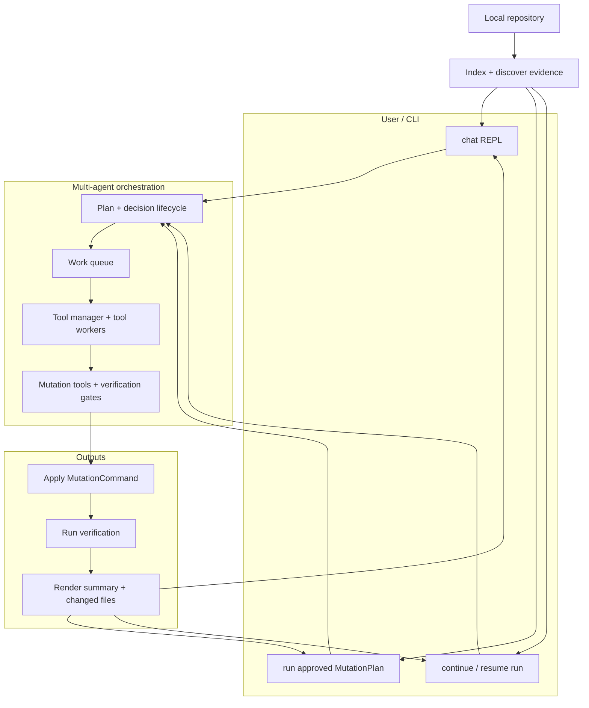

# mana-agent

> Multi-agent-powered repository analysis, evidence-backed Q&A, and tool-aware coding automation for local codebases.

`mana-agent` is an installable Python CLI for understanding and changing software projects. It can index a repository, run static and dependency analysis, generate reports, answer repository-grounded questions, and drive a constrained coding agent that can inspect files, apply patches, and run verification commands.

**Current documented version:** `v0.0.10`

---

## Table of Contents

* [Why mana-agent?](#why-mana-agent)
* [Features](#features)
* [Interface Preview](#interface-preview)
* [How It Works](#how-it-works)
* [Requirements](#requirements)
* [Installation](#installation)
* [Configuration](#configuration)
* [Quick Start](#quick-start)
* [CLI Reference](#cli-reference)
* [Approved Mutation Plans](#approved-mutation-plans)
* [Generated Artifacts](#generated-artifacts)
* [Coding Agent Safety Model](#coding-agent-safety-model)
* [Project Layout](#project-layout)
* [Documentation](#documentation)
* [Development](#development)
* [License](#license)

---

## Why mana-agent?

Large codebases are hard to inspect, summarize, and safely modify. `mana-agent` helps make repository work repeatable, traceable, and evidence-driven.

Use it to:

* **Analyze** a local project and generate structured reports.
* **Ask** repository-aware questions grounded in indexed code.
* **Chat** with an interactive assistant for planning, code inspection, patching, and verification.
* **Run approved mutation plans** through a controlled execution flow.
* **Persist coding-flow state** so multi-turn tasks can continue across sessions.
* **Control file mutation** through explicit repository tools instead of unrestricted editing.

---

## Features

### Repository analysis

`mana-agent` can inspect a project directory and generate artifacts for automation, documentation, and review.

Supported analysis outputs include:

* JSON
* Markdown
* HTML
* DOT graph
* GraphML
* Mermaid diagram

---

### Interactive coding assistant

The `chat` command opens an interactive REPL for repository Q&A and coding workflows.

It supports:

* Repository-aware answers
* Planning mode
* Coding memory
* Tool-worker execution paths
* Mermaid diagram rendering
* Multi-step coding-agent loops
* Verification after changes when supported

---

### Approved mutation execution

For deterministic changes, `mana-agent` can execute an approved mutation plan with:

```bash
mana-agent run --root-dir /path/to/project --plan-id mp_a672168ef9c0
```

This separates planning and approval from actual mutation execution.

---

### Multi-agent orchestration

`mana-agent` is designed around a multi-agent workflow with:

* Main decision/planning lifecycle
* Work queue
* Tool manager
* Tool workers
* Mutation tools
* Verification gates
* Execution traces
* Final summaries

---

## How It Works



For a standalone diagram, see:

```text
docs/07-diagram.md
```

---

## Requirements

* Python **3.10 through 3.14**
* An OpenAI-compatible chat endpoint
* An OpenAI-compatible embedding endpoint
* API keys and model configuration
* Local repository access

The default dependency set uses CPU FAISS for local vector search. Redis/RQ support is available for optional tool-worker execution paths.

---

## Installation

### Option 1: Install from GitHub with `pipx`

```bash
pipx install git+https://github.com/ah2727/mana-agent.git
```

Confirm the CLI is available:

```bash
mana-agent --help
```

---

### Option 2: Local editable install

Clone the repository, then create and activate a virtual environment:

```bash
python3 -m venv .venv
source .venv/bin/activate
```

Install the project:

```bash
python -m pip install --upgrade pip
python -m pip install -e .
```

Install common development tools:

```bash
python -m pip install pytest ruff mypy
```

Check the CLI:

```bash
mana-agent --help
```

---

## Latest Dev Binaries

You can download the latest development prerelease binary from the `latest-dev` GitHub release.

### Linux x64

```bash
curl -L -o mana-agent https://github.com/ah2727/mana-agent/releases/download/latest-dev/mana-agent-linux-x64
chmod +x mana-agent
sudo mv mana-agent /usr/local/bin/mana-agent
mana-agent --help
```

### macOS Apple Silicon

```bash
curl -L -o mana-agent https://github.com/ah2727/mana-agent/releases/download/latest-dev/mana-agent-macos-arm64
chmod +x mana-agent
sudo mv mana-agent /usr/local/bin/mana-agent
mana-agent --help
```

### macOS Intel

```bash
curl -L -o mana-agent https://github.com/ah2727/mana-agent/releases/download/latest-dev/mana-agent-macos-x64
chmod +x mana-agent
sudo mv mana-agent /usr/local/bin/mana-agent
mana-agent --help
```

### Windows PowerShell

```powershell
Invoke-WebRequest -Uri "https://github.com/ah2727/mana-agent/releases/download/latest-dev/mana-agent-windows-x64.exe" -OutFile "mana-agent.exe"
.\mana-agent.exe --help
```

---

## Configuration

Configure model providers and agent behavior with environment variables or a local `.env` file.

```bash
OPENAI_API_KEY="sk-..."
OPENAI_BASE_URL="https://api.openai.com/v1"

OPENAI_CHAT_MODEL="gpt-4.1"
OPENAI_TOOL_WORKER_MODEL="gpt-4.1"
OPENAI_CODING_PLANNER_MODEL="gpt-4.1"
OPENAI_EMBED_MODEL="text-embedding-3-small"

DEFAULT_TOP_K=8

# Mutation execution
MUTATION_MAX_STEPS=25
MUTATION_VERIFY_ON_CHANGE=1
```

### Environment variables

| Variable                      | Purpose                                                                          |
| ----------------------------- | -------------------------------------------------------------------------------- |
| `OPENAI_API_KEY`              | API key used for chat and embedding requests.                                    |
| `OPENAI_BASE_URL`             | Base URL for an OpenAI-compatible provider.                                      |
| `OPENAI_CHAT_MODEL`           | Default chat model for analysis and Q&A.                                         |
| `OPENAI_TOOL_WORKER_MODEL`    | Model used by optional tool-worker execution paths.                              |
| `OPENAI_CODING_PLANNER_MODEL` | Model used for coding-agent planning.                                            |
| `OPENAI_EMBED_MODEL`          | Embedding model used for semantic indexing.                                      |
| `DEFAULT_TOP_K`               | Default number of search results returned by retrieval workflows.                |
| `MUTATION_MAX_STEPS`          | Upper bound for tool/mutation work items per approved plan.                      |
| `MUTATION_VERIFY_ON_CHANGE`   | When `1`, run verification gates after applying mutation changes when supported. |

---

## Quick Start

### 1. Open a chat session

```bash
mana-agent chat --root-dir /path/to/project
```

### 2. Start an interactive coding workflow

```bash
mana-agent chat --root-dir . --planning-mode --coding-memory
```

### 3. Run an approved mutation plan

```bash
mana-agent run --root-dir /path/to/project --plan-id mp_a672168ef9c0
```

---

## CLI Reference

All commands support:

```bash
--help
```

Structured `--json` output is available where supported.

### `mana-agent chat`

Starts an interactive REPL for repository Q&A and coding-agent tasks.

```bash
mana-agent chat --root-dir .
```

Common options:

| Option                    | Purpose                                              |
| ------------------------- | ---------------------------------------------------- |
| `--root-dir`              | Project root for tools and coding memory.            |
| `--flow-id`               | Resume or pin a coding flow.                         |
| `--planning-mode`         | Ask planning questions before execution.             |
| `--auto-execute-plan`     | Execute generated plans.                             |
| `--full-auto`             | Continue auto-execution until completion or a limit. |
| `--coding-memory`         | Enable persisted coding-flow state.                  |
| `--no-coding-memory`      | Disable persisted coding-flow state.                 |
| `--tool-worker-process`   | Run tools through the worker-process path.           |
| `--multiline-input`       | Allow multiline REPL input.                          |
| `--diagram-render-images` | Render Mermaid diagrams to image artifacts.          |

Example:

```bash
mana-agent chat --root-dir . --planning-mode --coding-memory
```

Coding memory is stored under the analyzed project:

```text
<project>/.mana/index/chat_memory.sqlite3
```

---

### In-chat `/analyze`

Inside a chat session, run `/analyze` to analyze the current project and generate report artifacts under `.mana/`.

With no arguments, `/analyze` opens a format menu:

```text
/analyze

Select output format:

1. JSON
2. Markdown
3. HTML
4. DOT graph
5. GraphML
6. Mermaid diagram
7. All formats

Enter choice:
```

Direct forms skip the menu:

```bash
/analyze all
/analyze json markdown html
/analyze --format json,markdown,html
```

Aliases and notes:

* `md` is an alias for `markdown`.
* `mermaid` writes `.mana/diagram.mmd`.
* `all` generates every supported format.
* `/analyze` is read-only apart from generated `.mana/` artifacts.
* `/analyze` runs before normal chat messages reach the model.

---

### `mana-agent run`

Runs an approved mutation plan against a target repository.

```bash
mana-agent run --root-dir /path/to/project --plan-id mp_a672168ef9c0
```

This command is useful when you want deterministic execution after a plan has already been reviewed or approved.

---

### Useful global flag example

```bash
mana-agent --output-dir .mana/output chat
```

---

## Approved Mutation Plans

If you have an approved workflow or mutation plan ID, you can execute it deterministically:

```bash
mana-agent run --root-dir /path/to/project --plan-id mp_a672168ef9c0
```

The run command compiles the approved plan into an internal executable `MutationCommand` contract.

Example contract form:

```text
MutationCommand(mp_d26c0f4dd341)
```

> You normally run the plan through `mana-agent run --plan-id ...`. The `MutationCommand(...)` form is shown only to make the executable contract explicit.

---

## Generated Artifacts

By default, analysis artifacts are written under the analyzed project’s `.mana/` directory.

Depending on the requested formats, generated files can include:

```text
.mana/analyze.json
.mana/analyze.md
.mana/analyze.html
.mana/analyze.dot
.mana/analyze.graphml
.mana/diagram.mmd
```

Artifact usage:

| Artifact | Purpose                                   |
| -------- | ----------------------------------------- |
| JSON     | Scripts, CI, and automation.              |
| Markdown | Reviewable summaries and documentation.   |
| HTML     | Navigable reports.                        |
| DOT      | Graph visualization workflows.            |
| GraphML  | Graph tools and dependency visualization. |
| Mermaid  | Embeddable architecture diagrams.         |

---

## Coding Agent Safety Model

The coding agent is built around explicit, traceable tool use.

Typical flow:

1. Understand the request and active flow context.
2. Plan concrete steps before editing.
3. Search the repository with text and semantic tools.
4. Read target files before changing them.
5. Patch or write files through constrained repository tools.
6. Run relevant verification where possible.
7. Revise after failed checks when the agent can continue safely.
8. Finalize with changed files, checks, skipped checks, and warnings.

Available repository tools include:

* Semantic search
* Text search
* File listing
* Symbol lookup
* File reads
* Chunk reads
* Patch application
* File writes
* Command execution
* Verification
* Git status
* Git diff
* Tool-contract inspection

---

## Project Layout

```text
src/mana_agent/
  analysis/       Static analysis and chunking
  commands/       CLI commands, chat input, and output rendering
  config/         Settings and environment handling
  dependencies/   Dependency graph support
  describe/       Repository description service
  multi_agent/    Multi-agent runtime, work queue, tool managers, workers, traces
  parsers/        Python and multi-language parser entry points
  renderers/      HTML report rendering
  services/       Index, ask, analyze, report, structure, and security services
  tools/          Agent tools for repository access and mutation
  utils/          Discovery, IO, logging, guards, and tool-run helpers
  vector_store/   FAISS vector-store wrapper

tests/            Pytest suite
docs/             User and developer documentation
.github/          CI workflow configuration
```

---

## Documentation

Additional documentation is available in `docs/`.

| Doc                                                        | Description                              |
| ---------------------------------------------------------- | ---------------------------------------- |
| [`docs/01-overview.md`](./docs/01-overview.md)             | Project goals and high-level behavior.   |
| [`docs/02-installation.md`](./docs/02-installation.md)     | Setup and installation details.          |
| [`docs/03-quick-start.md`](./docs/03-quick-start.md)       | First commands to run.                   |
| [`docs/04-commands.md`](./docs/04-commands.md)             | CLI command reference.                   |
| [`docs/05-configuration.md`](./docs/05-configuration.md)   | Environment and settings guidance.       |
| [`docs/06-workflows.md`](./docs/06-workflows.md)           | Common analysis and coding workflows.    |
| [`docs/07-diagram.md`](./docs/07-diagram.md)               | Mermaid project diagram.                 |
| [`docs/08-architecture.md`](./docs/08-architecture.md)     | Internal architecture overview.          |
| [`docs/09-agent-behavior.md`](./docs/09-agent-behavior.md) | How the agent plans and acts.            |
| [`docs/10-error-handling.md`](./docs/10-error-handling.md) | Failure modes and recovery behavior.     |
| [`docs/11-logging.md`](./docs/11-logging.md)               | Logging behavior and options.            |
| [`docs/12-testing.md`](./docs/12-testing.md)               | Test strategy and commands.              |
| [`docs/13-tool-system.md`](./docs/13-tool-system.md)       | Repository tool contracts and execution. |
| [`docs/14-release.md`](./docs/14-release.md)               | Release process notes.                   |
| [`docs/15-development.md`](./docs/15-development.md)       | Development workflow.                    |
| [`docs/analyze.md`](./docs/analyze.md)                     | Additional analysis documentation.       |

---

## Development

Run the test suite:

```bash
pytest -q
```

Run local quality checks:

```bash
ruff check src tests
mypy src tests
python -c "import mana_agent; print('ok')"
mana-agent --help
mana-agent chat --help
```

The repository includes a GitHub Actions workflow that installs the package on Python 3.12 and runs the pytest suite.

---

## License

MIT License.
