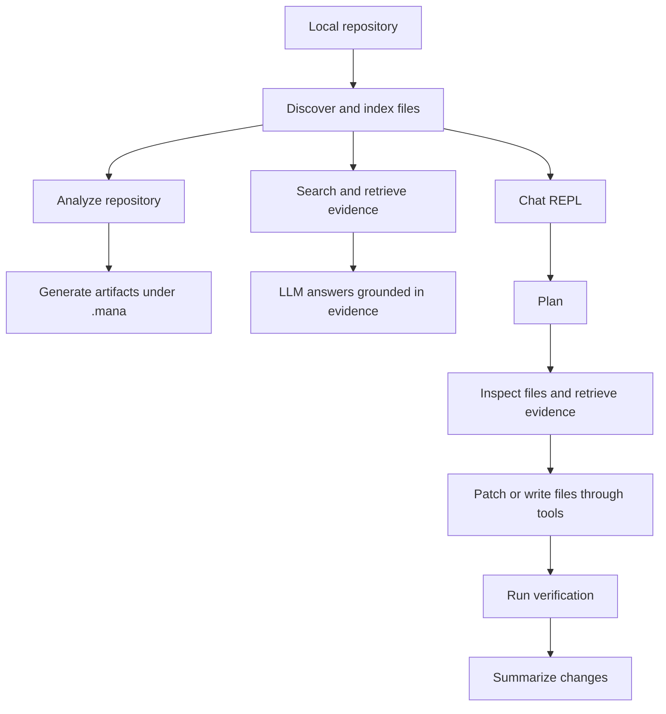
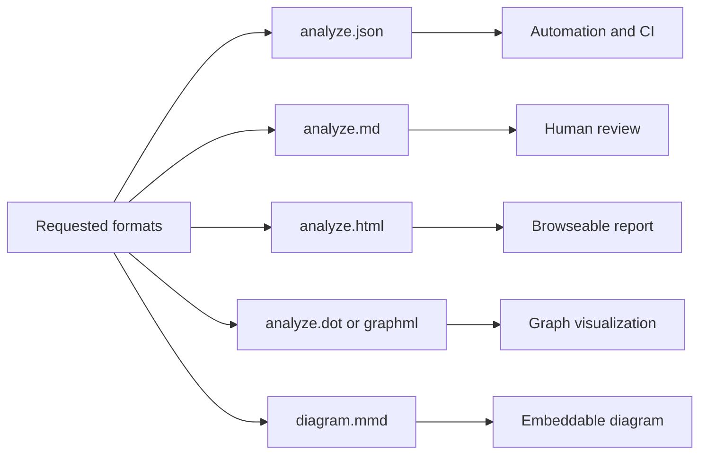
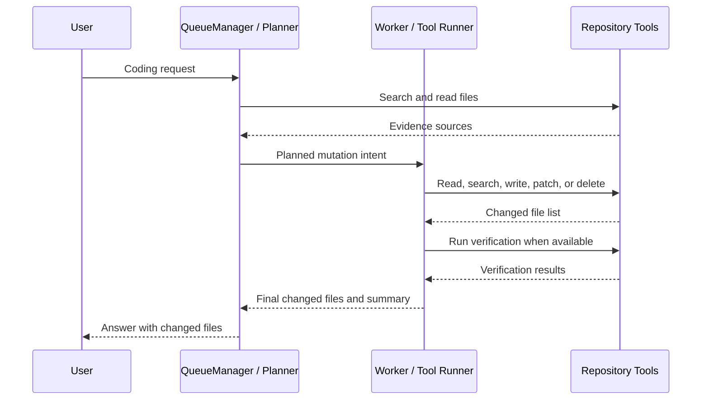

# Project Diagram

This page contains Mermaid diagrams that summarize how `mana-agent`
coordinates repository discovery, artifact generation, and coding workflows.

## High-level flow

## Artifact outputs

## Coding-agent tool lifecycle

