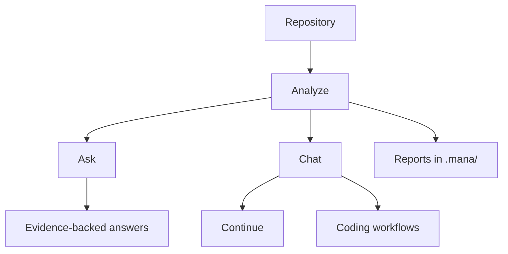

# Project Diagram

```mermaid
flowchart TD
    A[Repository] --> B[Analyze]
    B --> C[Ask]
    B --> D[Chat]
    D --> E[Continue]
    B --> F[Reports in .mana/]
    C --> G[Evidence-backed answers]
    D --> H[Coding workflows]
```

This diagram shows the main repository analysis and agent workflows described in the main README.
