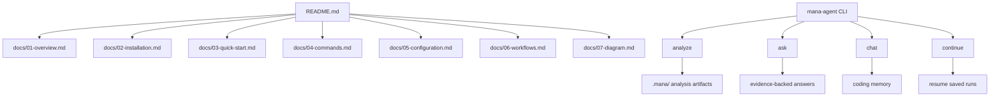

# mana-agent Repository Diagram and Docs

This file adds a compact diagram and points to the project documentation that is already present in this repository.

## Diagram

## Docs linked from README

The repository README already links to these documentation files:

- [Overview](./docs/01-overview.md)
- [Installation](./docs/02-installation.md)
- [Quick Start](./docs/03-quick-start.md)
- [Commands](./docs/04-commands.md)
- [Configuration](./docs/05-configuration.md)
- [Workflows](./docs/06-workflows.md)
- [Project Diagram](./docs/07-diagram.md)

## What the docs cover

- `docs/01-overview.md` describes the repository assistant’s purpose and how it gathers evidence before answering.
- `docs/02-installation.md` covers the real local install path for this Python package.
- `docs/03-quick-start.md` shows common `mana-agent` analyze, ask, and chat invocations.
- `docs/04-commands.md` documents the CLI commands `analyze`, `ask`, `chat`, and `continue`.
- `docs/05-configuration.md` explains the environment settings used by the package.
- `docs/06-workflows.md` summarizes the repository-analysis and coding-agent workflows.
- `docs/07-diagram.md` provides the standalone project diagram referenced by the README.
